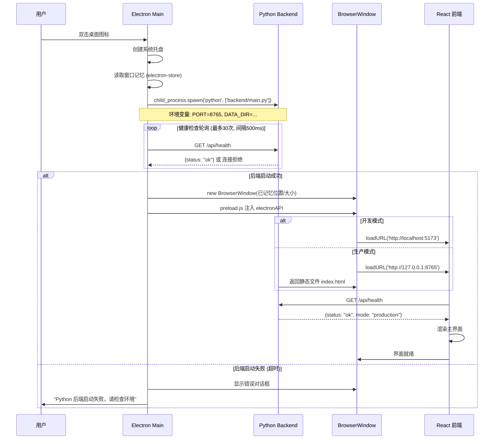
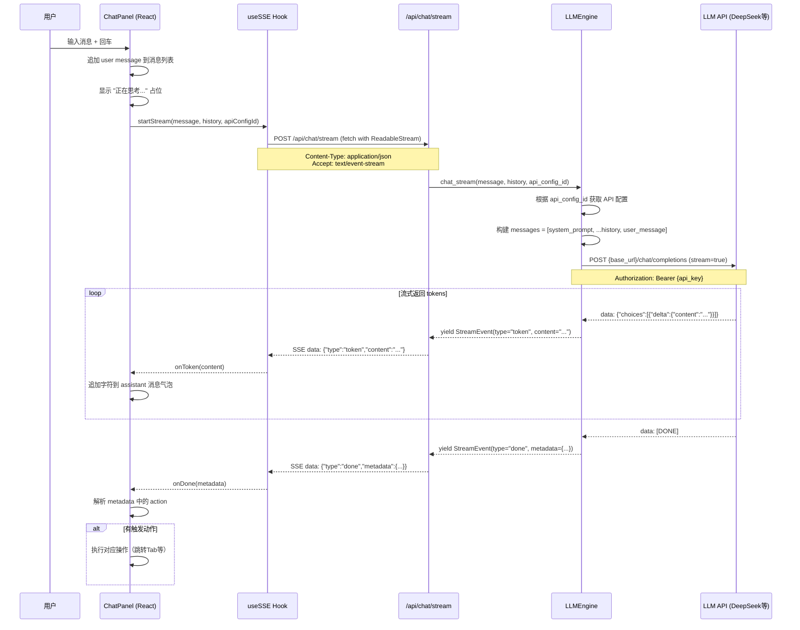
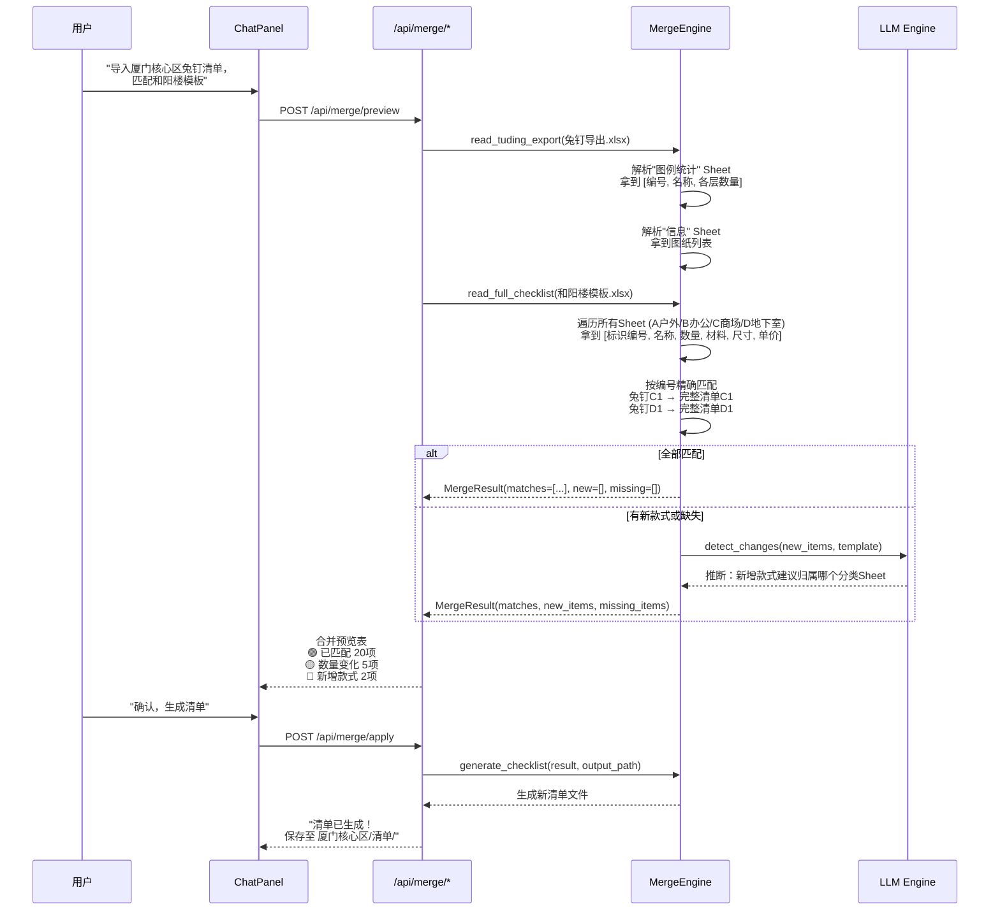
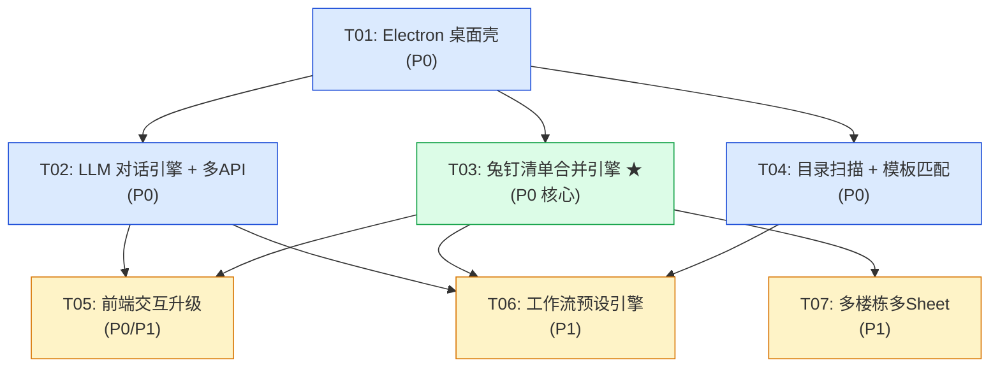

# FindWay Agent V2 系统架构设计与任务分解

> **作者**：高见远（Bob，架构师）  
> **日期**：2026-05-24  
> **基于**：V2 PRD + V1 代码分析

---

# Part A：系统设计

## 1. 实现方案

### 1.1 整体架构

V2 采用 **Electron（壳）+ React（前端）+ Python FastAPI（后端）** 三层架构：

```
┌──────────────────────────────────────────────────┐
│                Electron 桌面壳                     │
│  ┌─────────────────┐   ┌──────────────────────┐  │
│  │  Main Process    │   │  Renderer Process     │  │
│  │  (Node.js)       │   │  (Chromium + React)   │  │
│  │                  │   │                       │  │
│  │  • 窗口管理       │   │  • V1 React 前端      │  │
│  │  • 系统托盘       │   │  • SSE 流式对话       │  │
│  │  • IPC 桥接       │   │  • 模型切换下拉       │  │
│  │  • 子进程管理     │   │  • 状态栏             │  │
│  │  • 原生通知       │   │                       │  │
│  │  • 窗口记忆       │   │                       │  │
│  └────────┬─────────┘   └──────────┬───────────┘  │
│           │ child_process.spawn     │ fetch/SSE    │
│           ▼                        ▼              │
│  ┌─────────────────────────────────────────────┐  │
│  │        Python FastAPI (localhost:8765)       │  │
│  │  • LLM 对话引擎 (OpenAI 兼容 + SSE 流式)     │  │
│  │  • 多 API 配置管理                           │  │
│  │  • 目录扫描 + 旧项目模板匹配                  │  │
│  │  • 兔钉清单合并引擎 (核心P0)                  │  │
│  │  • 工作流预设引擎 (一键触发)                  │  │
│  │  • 静态文件服务 (生产模式)                    │  │
│  └─────────────────────────────────────────────┘  │
└──────────────────────────────────────────────────┘
```

### 1.2 核心技术挑战与选型

| 挑战 | 方案 | 理由 |
|------|------|------|
| **桌面打包** | Electron (非 Tauri) | V1 React 零成本接入，Windows 兼容性最佳，系统托盘/通知生态成熟 |
| **LLM 对话** | OpenAI 兼容 API + SSE 流式 | 支持 DeepSeek/通义千问/GPT，行业标准协议 |
| **流式输出** | FastAPI StreamingResponse + EventSource | 原生 SSE 支持，无需 WebSocket |
| **多 API 管理** | 配置数组存储在 config.json | 避免引入数据库，与 V1 一致 |
| **窗口记忆** | electron-store | 轻量持久化，无需外部 DB |
| **兔钉清单合并** | openpyxl 读取兔钉导出 + 完整清单模板，编号精确匹配 | 用户真实工作流核心：兔钉图例统计 → 自动填入完整清单 |
| **项目模板匹配** | 编号精确匹配 + LLM 辅助识别新增/变更款式 | 新项目套旧模板是唯一操作路径 |
| **后端进程管理** | child_process.spawn + 健康检查轮询 | 简单可靠，无需额外 IPC 协议 |

### 1.3 前后端通信方式

| 场景 | 方式 | 说明 |
|------|------|------|
| 前端 → 后端 API | `fetch()` → `http://127.0.0.1:8765/api/*` | RESTful，与 V1 一致 |
| LLM 流式响应 | `EventSource` → `POST /api/chat/stream` (SSE) | 流式打字效果 |
| Electron Main → Renderer | IPC (`contextBridge`) | 窗口控制、系统通知、原生能力 |
| Electron Main → Python | `child_process` 环境变量 | 端口、工作目录传递 |
| Python 后端退出 | `child_process` `exit` 事件 | Electron 检测并提示重启 |

---

## 2. 文件列表

> 标注：🆕 新建 | ✏️ 修改

### 2.1 Electron 层

```
signage-app/
├── 🆕 electron/
│   ├── 🆕 main.js              # Electron 主进程（窗口、托盘、Python管理）
│   └── 🆕 preload.js           # 预加载脚本（IPC 桥接）
```

### 2.2 后端层

```
signage-app/backend/
├── ✏️ main.py                   # 注册新路由（scanner/merge/workflow）
├── ✏️ config.json               # 重构 LLM 配置为多 API 数组结构
├── api/
│   ├── ✏️ chat.py               # 替换关键词识别为 LLM 引擎 + 流式端点
│   ├── ✏️ settings.py           # 兼容新多API配置，保持向后兼容
│   ├── 🆕 api_configs.py        # 多 API 配置 CRUD
│   ├── 🆕 scanner.py            # 目录扫描 + 项目发现 API
│   ├── 🆕 merge.py              # 兔钉清单合并 API（P0 核心）
│   └── 🆕 workflow.py           # 预设工作流 API（如"新项目启动"全流程）
├── services/
│   ├── 🆕 llm_engine.py         # LLM 对话引擎（流式、意图推理、多模型切换）
│   ├── 🆕 scanner_service.py    # 目录扫描与项目发现逻辑
│   ├── 🆕 merge_engine.py       # 兔钉导出→完整清单合并引擎（P0 核心）
│   └── 🆕 workflow_service.py   # 工作流编排引擎（串联多步骤操作）
```

### 2.3 前端层

```
signage-app/frontend/src/
├── ✏️ App.jsx                    # 添加 Electron API 检测
├── ✏️ main.jsx                   # 入口无大变化
├── components/
│   ├── ✏️ AppLayout.jsx          # 集成 StatusBar，model 状态提升
│   ├── ✏️ ChatPanel.jsx          # 流式 SSE + 模型选择器
│   ├── 🆕 StatusBar.jsx          # 底部状态栏
│   └── 🆕 ModelSelector.jsx      # 模型下拉切换组件
├── pages/
│   ├── ✏️ Settings.jsx           # 重构为标签页（API配置/目录监控/服务器/关于）
│   └── 🆕 ApiConfigManager.jsx   # API 配置增删改 UI
├── hooks/
│   └── 🆕 useSSE.js              # SSE 流式读取自定义 Hook
```

### 2.4 项目根层

```
signage-app/
├── ✏️ package.json               # 添加 electron/electron-builder/electron-store 依赖与脚本
├── ✏️ vite.config.js             # base 路径适配 Electron 生产模式
```

---

## 3. 数据结构与接口

### 3.1 核心数据模型（Pydantic）

```mermaid
classDiagram
    %% ===== 配置模型 =====
    class ApiConfig {
        +str id
        +str name
        +str provider
        +str base_url
        +str api_key
        +str model
        +bool enabled
        +str purpose
    }

    class TaskMapping {
        +str creative
        +str spec_query
        +str general
        +str compare
        +str matching
    }

    class LLMConfig {
        +List~ApiConfig~ apis
        +TaskMapping task_mapping
        +str default_api
    }

    class WatchDirectory {
        +str path
        +bool auto_scan
        +bool notify_new
        +str status
        +int found_count
        +str last_scan
    }

    class MonitorConfig {
        +List~WatchDirectory~ directories
        +bool scan_on_startup
        +bool notify_new_folder
    }

    %% ===== 项目模型 =====
    class ProjectResponse {
        +str id
        +str name
        +str project_type
        +List~str~ buildings
        +str notes
        +str stage
        +str created_at
        +str updated_at
        +str source
        +str source_path
    }

    class DiscoveredProject {
        +str folder_name
        +str folder_path
        +str project_type
        +List~str~ matched_files
        +float confidence
        +str parent_dir_id
    }

    %% ===== 对话模型 =====
    class ChatRequest {
        +str message
        +Optional~str~ project_id
        +Optional~str~ api_config_id
        +List~ChatMessage~ history
    }

    class ChatMessage {
        +str role
        +str content
        +str timestamp
    }

    class StreamEvent {
        +str type
        +str content
        +Optional~dict~ metadata
    }

    %% ===== 兔钉清单合并模型（P0 核心）=====
    class TuDingExport {
        +str project_name
        +List~str~ plans
        +List~TuDingItem~ items
    }

    class TuDingItem {
        +int seq
        +str code
        +str name
        +Dict~str,int~ plan_quantities
        +int total_quantity
    }

    class MergeResult {
        +str source_template
        +str target_file
        +List~MergeMatch~ matches
        +List~str~ new_items
        +List~str~ missing_items
    }

    class MergeMatch {
        +str code
        +str name
        +int old_qty
        +int new_qty
        +str sheet_name
        +int row
        +str status
    }

    %% ===== 关系 =====
    LLMConfig "1" *-- "0..*" ApiConfig : contains
    LLMConfig "1" *-- "1" TaskMapping : contains
    DiscoveredProject ..> WatchDirectory : belongs to
    WpsMappingResult ..> WpsSheetData : derived from
    WpsMappingResult "1" *-- "0..*" ColumnMapping : contains
    ChatRequest ..> ApiConfig : references
```



### 3.2 服务类（核心逻辑）

```mermaid
classDiagram
    class LLMEngine {
        -List~ApiConfig~ _api_configs
        -TaskMapping _task_mapping
        +__init__(config: dict)
        +get_active_configs() List~ApiConfig~
        +get_config_by_id(id: str) ApiConfig
        +chat_stream(message: str, history: list, api_config_id: str) AsyncGenerator
        +infer_intent(message: str) str
        +auto_select_model(intent: str) ApiConfig
        +map_wps_columns(raw_headers: list) WpsMappingResult
    }

    class ScannerService {
        -List~WatchDirectory~ _directories
        +__init__(config_path: str)
        +add_directory(path: str) WatchDirectory
        +remove_directory(path: str) bool
        +scan_all() List~DiscoveredProject~
        +scan_directory(path: str) List~DiscoveredProject~
        +is_project_folder(path: str) tuple
        +get_all_discovered() List~DiscoveredProject~
        +auto_register(projects: list) int
    }

    class MergeEngine {
        +__init__(config: dict)
        +read_tuding_export(file_path: str) TuDingExport
        +read_full_checklist(file_path: str) dict
        +merge(tuding: TuDingExport, template: str) MergeResult
        +generate_checklist(result: MergeResult, output_path: str) bool
        +detect_changes(old: dict, new: dict) List~MergeMatch~
    }

    class WorkflowService {
        -List~WorkflowStep~ _steps
        +__init__(config: dict)
        +define_workflow(name: str, steps: list)
        +execute(name: str, params: dict) dict
        +list_workflows() List~str~
        +new_project_startup(project_name: str, tuding_path: str, template_id: str) dict
    }

    LLMEngine ..> ApiConfig : uses
    ScannerService ..> DiscoveredProject : produces
    WPSService ..> WpsSheetData : produces
    LLMEngine ..> WpsMappingResult : produces
    PlatformService ..> PlatformProject : produces
```



### 3.3 API 端点

#### 新增端点

| 方法 | 路径 | 说明 | 优先级 |
|------|------|------|--------|
| `POST` | `/api/chat/stream` | LLM 流式对话（SSE） | P0 |
| `GET` | `/api/chat/models` | 获取可用模型列表 | P0 |
| `GET` | `/api/api-configs` | 列出所有 API 配置 | P0 |
| `POST` | `/api/api-configs` | 添加 API 配置 | P0 |
| `PUT` | `/api/api-configs/{id}` | 更新 API 配置 | P0 |
| `DELETE` | `/api/api-configs/{id}` | 删除 API 配置 | P0 |
| `POST` | `/api/api-configs/{id}/test` | 测试 API 连通性 | P0 |
| `GET` | `/api/scanner/directories` | 列出监控目录 | P0 |
| `POST` | `/api/scanner/directories` | 添加监控目录 | P0 |
| `DELETE` | `/api/scanner/directories` | 移除监控目录 | P0 |
| `POST` | `/api/scanner/scan` | 手动触发扫描 | P0 |
| `GET` | `/api/scanner/discovered` | 获取发现的项目 | P0 |
| `POST` | `/api/scanner/register` | 注册发现的为正式项目 | P0 |
| `POST` | `/api/merge/preview` | 兔钉导出→完整清单合并预览（不写入） | P0 |
| `POST` | `/api/merge/apply` | 应用合并结果，生成新清单文件 | P0 |
| `GET` | `/api/merge/templates` | 列出可用清单模板（旧项目清单） | P0 |
| `POST` | `/api/workflow/execute` | 执行预设工作流（如"新项目启动"） | P1 |
| `GET` | `/api/workflow/list` | 列出预设工作流 | P1 |
| `POST` | `/api/workflow/define` | 定义新工作流 | P1 |

#### 修改端点

| 方法 | 路径 | 变化 |
|------|------|------|
| `POST` | `/api/chat` | 保留兼容，内部转调 LLM 引擎 |
| `GET` | `/api/settings` | 返回新结构（多 API + 监控配置） |
| `PUT` | `/api/settings` | 支持新结构更新 |

### 3.4 Electron IPC 接口

```javascript
// preload.js 暴露给渲染进程的 API
window.electronAPI = {
  // 窗口控制
  minimizeWindow: () => ipcRenderer.send('window-minimize'),
  maximizeWindow: () => ipcRenderer.send('window-maximize'),
  closeWindow:    () => ipcRenderer.send('window-close'),

  // 信息查询
  getAppVersion:    () => ipcRenderer.invoke('get-app-version'),
  getPlatformInfo:  () => ipcRenderer.invoke('get-platform-info'),

  // 系统通知（P2）
  showNotification: (title, body) => ipcRenderer.send('show-notification', { title, body }),

  // 事件监听
  onTrayAction:     (callback) => ipcRenderer.on('tray-action', callback),
  onPythonStatus:   (callback) => ipcRenderer.on('python-status', callback)
};
```

### 3.5 配置文件结构变化

#### config.json（V2 新结构）

```json
{
  "modules": { /* 保持不变 */ },
  "workflow": { /* 保持不变 */ },
  "matching_rules": { /* 保持不变 */ },
  "list_template": { /* 保持不变 */ },
  "llm": {
    "apis": [
      {
        "id": "deepseek-v3",
        "name": "DeepSeek V3",
        "provider": "openai_compatible",
        "base_url": "https://api.deepseek.com/v1",
        "api_key": "",
        "model": "deepseek-chat",
        "enabled": true,
        "purpose": "通用对话"
      }
    ],
    "task_mapping": {
      "creative": "deepseek-v3",
      "spec_query": "deepseek-v3",
      "general": "deepseek-v3",
      "compare": "deepseek-v3",
      "matching": "deepseek-v3"
    },
    "default_api": "deepseek-v3"
  },
  "monitor": {
    "directories": [],
    "scan_on_startup": true,
    "notify_new_folder": false
  },
  "platform": {
    "enabled": false,
    "base_url": "",
    "api_key": "",
    "sync_interval_minutes": 30
  }
}
```

---

## 4. 程序调用流程

### 4.1 Electron 启动 → Python 后端启动 → 前端加载



### 4.2 LLM 流式对话（核心交互）



### 4.3 兔钉清单合并流程（P0 核心）



---

## 5. 待明确事项

| # | 问题 | 影响范围 | 结论/建议 |
|---|------|---------|---------|
| **Q1** | WPS版本：个人版 | 不影响核心功能 | 兔钉导出 + openpyxl 读文件，不依赖 COM |
| **Q2** | 格原协同平台：OA 系统，不需要接入 | 从 V2 移除 | 用户自行操作，不影响工作流 |
| **Q3** | LLM System Prompt 领域知识（标识设计规范等） | LLM 对话质量 | 需用户提供标识设计领域的专业术语和规范 |
| **Q4** | 项目文件夹特征识别 | 目录扫描 | 统一结构：`项目名/图纸/资料/清单/`，以清单目录下 xlsx 为标识 |
| **Q5** | 多楼栋多Sheet清单管理 | 清单合并引擎 | 每个楼栋一个 Sheet，Sheet名即楼栋名，每Sheet内分 A/B/C/D 区 |
| **Q6** | 兔钉"图例统计"格式是否统一 | 合并引擎 | 已验证：序号/编号/名称 + 各层数量列，格式统一 |

---

# Part B：任务分解

## 6. 依赖包列表

### 6.1 Python 新增依赖

```
- openai>=1.30.0           # OpenAI 兼容客户端（用于流式调用）
- openpyxl>=3.1.0          # Excel 文件读写（兔钉导出 + 完整清单）
- python-multipart>=0.0.9  # 文件上传支持
```

### 6.2 Node 新增依赖

```
- electron@^31.0.0           # Electron 桌面壳
- electron-builder@^24.0.0   # 打包工具
- electron-store@^8.2.0      # 窗口状态/配置持久化
```

---

## 7. 任务列表（基于真实工作流）

### 任务总览

| 任务 | 名称 | 优先级 | 依赖 | 文件数 |
|------|------|--------|------|--------|
| T01 | Electron 桌面壳 | P0 | 无 | 5 |
| T02 | LLM 对话引擎 + 多API后端 | P0 | T01 | 4 |
| T03 | **兔钉清单合并引擎**（核心） | P0 | T01 | 3 |
| T04 | 本地目录扫描 + 项目模板匹配 | P0 | T01 | 2 |
| T05 | 前端交互升级 | P0/P1 | T02,T03 | 8 |
| T06 | 工作流预设引擎 | P1 | T02,T03,T04 | 2 |
| T07 | 多楼栋多Sheet管理 | P1 | T03 | 2 |

---

### T01：Electron 桌面壳

- **优先级**：P0
- **依赖**：无

| 文件 | 操作 | 用途 |
|------|------|------|
| `signage-app/electron/main.js` | 🆕 | Electron 主进程：窗口、托盘、Python spawn、IPC |
| `signage-app/electron/preload.js` | 🆕 | IPC 桥接 |
| `signage-app/package.json` | ✏️ | 添加 electron 依赖 + dev/build 脚本 |
| `signage-app/vite.config.js` | ✏️ | 适配 Electron base 路径 |
| `signage-app/backend/main.py` | ✏️ | 环境变量 PORT + 健康检查增强 |

**关键实现点**：
1. 启动时 spawn Python 后端，轮询 `/api/health`（最多30次）
2. 系统托盘右键菜单：显示主窗口 / 退出
3. 关闭窗口隐藏到托盘，退出时 kill Python
4. window state 用 `electron-store` 记忆位置/大小

---

### T02：LLM 对话引擎 + 多API配置后端

- **优先级**：P0
- **依赖**：T01

| 文件 | 操作 | 用途 |
|------|------|------|
| `signage-app/backend/services/llm_engine.py` | 🆕 | LLM 引擎：流式调用、意图推理 |
| `signage-app/backend/api/chat.py` | ✏️ | 新增 `/api/chat/stream` (SSE)，保留旧 `/api/chat` |
| `signage-app/backend/api/api_configs.py` | 🆕 | 多 API 配置 CRUD + 连通性测试 |
| `signage-app/backend/config.json` | ✏️ | LLM 段重构为 `apis[]` 数组 |

**关键实现点**：
1. `llm_engine.py`：OpenAI 兼容 `AsyncOpenAI`，SSE 流式逐 token
2. `POST /api/chat/stream` 返回 `text/event-stream`
3. `api_configs.py`：增删改查 API 配置（base_url/api_key/model），mask API Key 返回
4. 意图推理：LLM 根据对话内容判断用户意图，而非关键词匹配

---

### T03：兔钉清单合并引擎（V2 杀手功能）★

- **优先级**：P0
- **依赖**：T01

| 文件 | 操作 | 用途 |
|------|------|------|
| `signage-app/backend/services/merge_engine.py` | 🆕 | 核心合并逻辑：读取兔钉导出 + 完整清单模板 + 编号匹配 + 数量填入 |
| `signage-app/backend/api/merge.py` | 🆕 | 合并 API：/preview（预览不写入）/apply（生成文件）/templates（列出模板） |

**核心逻辑**：

1. **`read_tuding_export(path)`**：解析兔钉 .xlsx 的"图例统计" Sheet
   - 提取 [序号, 编号, 名称] + 各楼层/图纸数量列
   - 计算每个编号的**总数量**（跨所有楼层列求和）
   - 解析"信息" Sheet 拿项目名和图纸列表

2. **`read_full_checklist(path)`**：解析完整清单模板（如和阳楼格式）
   - 遍历所有 Sheet（A户外/B办公/C商场/D地下室）
   - 提取每个 Sheet 的 [序号, 标识编号, 标识名称, 数量, 材料, 尺寸, 单价, 是否带电]
   - 建立 `{编号 → {sheet, row, 原数据}}` 索引

3. **`merge(tuding, template)`**：按编号精确匹配
   - 🟢 模板有 + 兔钉也有 → `MergeMatch(status="matched", old_qty, new_qty)`
   - 🟡 模板有 + 兔钉没有 → `MergeMatch(status="zeroed", old_qty, new_qty=0)`
   - 🔴 兔钉有 + 模板没有 → `status="new_item"` → 交给 LLM 推断归属分类 Sheet
   - 结果中标注每个匹配项的 sheet_name 和 row 位置

4. **`generate_checklist(result, output_path)`**：生成新清单
   - 复制模板文件
   - 按 MergeResult 逐行更新数量列
   - 新增款式追加到对应 Sheet 末尾（带黄色标注）
   - 更新汇总 Sheet 公式

**为什么编号匹配不需要 LLM**：兔钉和完整清单使用**同一套编号体系**（C1→C1, D1→D1），这是确定性映射。LLM 只在新增款式归属判定时用。

---

### T04：本地目录扫描 + 项目模板匹配

- **优先级**：P0
- **依赖**：T01

| 文件 | 操作 | 用途 |
|------|------|------|
| `signage-app/backend/services/scanner_service.py` | 🆕 | 递归扫描、项目识别 |
| `signage-app/backend/api/scanner.py` | 🆕 | 扫描 API |

**关键实现点**：
1. 识别规则：文件夹下存在 `清单/` 子目录 + 含 `.xlsx` 文件 = 一个项目
2. 项目命名：从文件夹名推断（`1.白云党校` → 项目名"白云党校"）
3. 三级结构：`{项目}/图纸/` `{项目}/资料/` `{项目}/清单/`
4. 自动匹配旧项目模板：新项目输入"学校" → 返回同类型清单模板 Top 3
5. 扫描结果持久化到 `data/discovered_projects.json`

---

### T05：前端交互升级

- **优先级**：P0（流式对话 + 合并预览）+ P1（API面板 + 工作流UI）
- **依赖**：T02, T03

| 文件 | 操作 | 用途 |
|------|------|------|
| `signage-app/frontend/src/hooks/useSSE.js` | 🆕 | SSE 流式读取 Hook |
| `signage-app/frontend/src/components/ChatPanel.jsx` | ✏️ | 流式打字 + 模型选择器 |
| `signage-app/frontend/src/components/ModelSelector.jsx` | 🆕 | 模型下拉切换 |
| `signage-app/frontend/src/components/StatusBar.jsx` | 🆕 | 底部状态栏 |
| `signage-app/frontend/src/components/AppLayout.jsx` | ✏️ | 集成 StatusBar + model state |
| `signage-app/frontend/src/pages/MergePreview.jsx` | 🆕 | 合并预览页：🟢🔴🟡 三色标注表格 |
| `signage-app/frontend/src/pages/Settings.jsx` | ✏️ | Tab 结构：API配置/目录监控/工作流/关于 |
| `signage-app/frontend/src/pages/ApiConfigManager.jsx` | 🆕 | API 配置增删改表单 |

**MergePreview.jsx 设计要点**：
- 三色标注表格：绿=已匹配，黄=数量变化，红=新增
- 用户可逐行确认/修改
- "应用到清单"按钮 → POST /api/merge/apply

---

### T06：工作流预设引擎

- **优先级**：P1
- **依赖**：T02, T03, T04

| 文件 | 操作 | 用途 |
|------|------|------|
| `signage-app/backend/services/workflow_service.py` | 🆕 | 工作流编排引擎 |
| `signage-app/backend/api/workflow.py` | 🆕 | 工作流 API |

**预设工作流：新项目启动（一键触发）**
```
1. 输入：项目名 + 项目类型 + 兔钉导出文件
2. 自动匹配同类型旧项目模板
3. 复制模板 → 改项目名
4. 导入兔钉导出 → 合并数量
5. 生成清单 → 保存到 清单/ 目录
6. 创建项目卡片
7. 报告结果："已创建 XX项目 清单，20项匹配，2项新增"
```

工作流配置存储在 `config.json` 的 `workflows` 段，用户可通过对话自定义修改步骤。

---

### T07：多楼栋多Sheet管理

- **优先级**：P1
- **依赖**：T03

| 文件 | 操作 | 用途 |
|------|------|------|
| `signage-app/backend/services/merge_engine.py` | ✏️ | 添加多Sheet遍历 + 楼栋Sheet识别 |
| `signage-app/backend/api/merge.py` | ✏️ | API 支持指定Sheet合并 |

**场景**：一个清单文件含 `1栋`/`2栋`/`3栋` 等多个Sheet，每Sheet内按 A/B/C/D 分区

**实现**：
1. 识别 Sheet 名称模式（含"栋""号楼"等字样的为楼栋Sheet）
2. 合并时按 Sheet 独立匹配编号（同一编号在不同楼栋的数量不同）
3. 预览页显示楼栋级差异

---

## 8. 共享知识（跨文件约定）

### 8.1 API 响应规范

所有 API 返回统一格式：
```json
{
  "code": 0,
  "data": { ... },
  "message": "success"
}
```
- `code: 0` 表示成功，非零表示错误码
- SSE 流式端点除外（直接返回 `text/event-stream`）

### 8.2 端口约定

| 服务 | 端口 | 说明 |
|------|------|------|
| Python FastAPI | `8765` | 固定，通过环境变量 `PORT` 可覆盖 |
| Vite Dev Server | `5173` | 仅开发模式 |
| Electron 内加载 | `8765`（生产）/ `5173`（开发）| 由 `NODE_ENV` 判断 |

### 8.3 API Key 存储

- 明文存储于 `backend/config.json` 的 `llm.apis[].api_key` 字段
- 桌面应用本地运行，用户自行负责安全
- 前端传输时 API Key 不返回给客户端（`api_configs.py` 返回列表时 mask 处理）

### 8.4 配置文件格式

- `config.json` 使用 JSON（便于 Python/Node 双向读写）
- 结构变更时向后兼容：丢失字段用默认值填充

### 8.5 路径约定

- 所有相对路径基于 `signage-app/` 项目根
- Electron 工作目录：`app.getAppPath()` 即 `signage-app/`
- Python 工作目录：`backend/` 目录，数据写入 `backend/data/`

### 8.6 模型意图分类

| 意图 | task_mapping key | 触发场景 |
|------|-----------------|---------|
| 创意推荐 | `creative` | 款式推荐、风格建议 |
| 规范查询 | `spec_query` | 设计规范、安装要求、标准 |
| 通用对话 | `general` | 项目管理、信息查询 |
| 清单对比 | `compare` | 对比两份清单差异 |
| 旧项目匹配 | `matching` | 搜索推荐旧项目 |

### 8.7 关键设计决策

1. **Electron 不直接代理 API**：前端仍通过 `fetch` 直连 Python 后端，Electron 仅负责壳功能
2. **Python 进程管理**：`child_process.spawn` 启动，崩溃时自动重启（最多 3 次）
3. **配置热重载保留**：V1 的 `/api/settings/reload` 端点继续工作
4. **对 V1 最小侵入**：新增文件为主，修改文件尽量保持原有逻辑不变
5. **SSE 非 WebSocket**：SSE 实现更简单，单向流式推送足够，无需双向

---

## 9. 任务依赖图



> 🔵 蓝色 = P0 基础 | 🟢 绿色 = P0 杀手功能 | 🟡 黄色 = P1 增强
